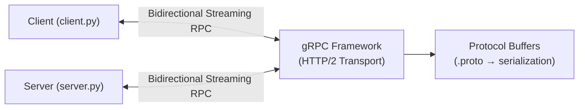

# Отчет по лабораторной работе №1


## 1. Титульный лист
Дисциплина: Распределенные системы (Distributed Systems)

Лабораторная работа №1  -  Реализация RPC-сервиса с использованием
gRPC   
  
---

## 2. Цель работы
- Освоить принципы удалённого вызова процедур (RPC) и их применение в распределённых системах.  
- Изучить основы фреймворка gRPC и языка определения интерфейсов Protocol Buffers (Protobuf).  
- Научиться определять сервисы и сообщения с помощью Protobuf.  
- Реализовать клиент-серверное приложение на Python с использованием gRPC.  
- Получить практические навыки генерации кода, реализации серверной логики и клиентских вызовов для Server Streaming RPC.

---
## 3. Номер и описание варианта задания
*   Вариант: 2
*   Предметная область: CRM-система
*   Описание сервиса и его методов: Сервис CustomerManager. Метод GetCustomersByRegion(Region) для получения потока клиентов из указанного региона (Server streaming RPC).
  
---
## 4. Настройка окружения


* `customer_manager.proto` - Главный файл с описанием сервиса и сообщений на языке Protobuf 
* `customer_manager_pb2.py` - Автоматически сгенерированный файл (из .proto) для работы с сообщениями 
* `customer_manager_pb2_grpc.py` - Автоматически сгенерированный файл (из .proto) для работы с сервисами gRPC 
* `server.py` - Серверная часть, реализует логику метода GetCustomersByRegion 
* `client.py` - Клиентская часть, отправляет запрос и получает поток клиентов 
* `__pycache__` - Папка с скомпилированными Python-файлами (создается автоматически) 


---

## 5.Архитектура системы


**Компоненты архитектуры**

**Client (client.py)**
Отправляет запрос с названием региона, получает и обрабатывает поток ответов от сервера.

**Server (server.py)**
Получает запрос, находит клиентов в указанном регионе и отправляет их потоком.

**gRPC Framework**
Обеспечивает транспортный уровень (HTTP/2) и управляет соединением.

**Protocol Buffers** 
Сериализует данные согласно .proto файлу.

---
### 6. Листинг .proto файла (`customer_manager.proto`)

```protobuf
syntax = "proto3";  // Указываем версию protobuf
package crm;        // Указываем пакет

service CustomerManager {
    rpc GetCustomersByRegion(RegionRequest) returns (stream CustomerResponse);  // stream для потока ответов
}

message RegionRequest {
    string region_name = 1;  // Название региона
}

message CustomerResponse {
    int32 id = 1;           // ID клиента
    string full_name = 2;    // Полное имя
    string email = 3;        // Email
    string phone = 4;        // Телефон
}
```
---

### 7. Листинг кода серверной части (server.py)
```python
import grpc
from concurrent import futures
import time
import customer_manager_pb2
import customer_manager_pb2_grpc

class CustomerManagerServicer(customer_manager_pb2_grpc.CustomerManagerServicer):
    """Реализация сервиса CustomerManager"""
    
    def GetCustomersByRegion(self, request, context):
        """Возвращает список клиентов по региону"""
        print(f"Request for region: {request.region_name}")

        # База данных клиентов
        customers = [
            {"id": 101, "name": "Ivan Ivanov", "email": "ivan@mail.ru", "phone": "555-01"},
            {"id": 102, "name": "Maria Petrova", "email": "masha@mail.ru", "phone": "555-02"},
            {"id": 103, "name": "Alex Smirnov", "email": "alex@mail.ru", "phone": "555-03"}
        ]

        # Отправляем каждого клиента отдельно (stream)
        for c in customers:
            response = customer_manager_pb2.CustomerResponse(
                id=c["id"],
                full_name=c["name"],
                email=c["email"],
                phone=c["phone"]
            )
            yield response  # Отправляем ответ
            time.sleep(1)   # Задержка для демонстрации стриминга

def serve():
    """Запуск сервера"""
    server = grpc.server(futures.ThreadPoolExecutor(max_workers=10))
    
    # Регистрируем сервис
    customer_manager_pb2_grpc.add_CustomerManagerServicer_to_server(
        CustomerManagerServicer(), server
    )
    
    # Запускаем на порту 50051
    server.add_insecure_port('[::]:50051')
    print("Server started on port 50051...")
    
    server.start()
    server.wait_for_termination()

if __name__ == '__main__':
    serve()
```
---
### 8. Листинг кода клиентской части (client.py)
```python
import grpc
import customer_manager_pb2
import customer_manager_pb2_grpc

def run():
    """Запуск клиента для получения списка клиентов"""
    with grpc.insecure_channel('localhost:50051') as channel:
        stub = customer_manager_pb2_grpc.CustomerManagerStub(channel)
        print("-- Requesting customer list ---")
        
        # Создаем запрос с указанием региона
        request = customer_manager_pb2.RegionRequest(region_name="Central")

        try:
            # Получаем поток ответов от сервера
            customer_stream = stub.GetCustomersByRegion(request)

            # Обрабатываем каждого полученного клиента
            for customer in customer_stream:
                print(f"Received customer: {customer.full_name}")
                print(f"  ID: {customer.id} | Email: {customer.email} | Phone: {customer.phone}")
                print("--" * 30)

        except grpc.RpcError as e:
            print(f"RPC Error: {e.code()}")

if __name__ == '__main__':
    run()
```

---
### 9. Скриншот, демонстрирующий работу программы 


## Выводы
Я разработала CRM-систему с сервисом CustomerManager, который возвращает список клиентов по региону через Server streaming RPC.

В ходе работы я:

-описала сервис и сообщения в .proto файле

-сгенерировала код через protoc

-написала сервер, который отправляет клиентов потоком

-сделала клиент, который получает и выводит этих клиентов

