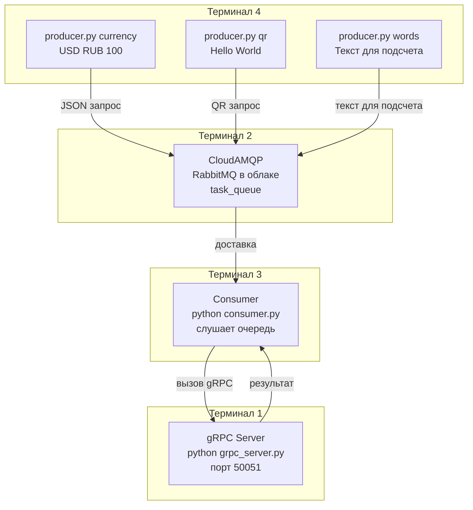

# Лабораторная работа № 3.1
## Тема. Организация асинхронного взаимодействия микросервисов с помощью брокера сообщений RabbitMQ.

###  Цель работы.
Изучить и реализовать два ключевых подхода к взаимодействию между сервисами:
1.  **Синхронное прямое взаимодействие** с использованием **gRPC**.
2.  **Асинхронное взаимодействие** через брокер сообщений **RabbitMQ**.
3.  Освоить развертывание инфраструктурных компонентов с помощью **Docker**.

### Инструменты и технологический стек.
*   **Операционная система:** Ubuntu 20.04+ (рекомендуется).
*   **Язык программирования:** Python 3.10+.
*   **Библиотеки:**
    *   `grpcio`, `grpcio-tools` (для gRPC).
    *   `pika` (клиент для RabbitMQ).
*   **Инфраструктура:**
    *   **Docker** и **Docker Compose** (для запуска RabbitMQ).
    *   **RabbitMQ** (брокер сообщений).

### Вариант 2.
1) Конвертация
валют. Producer
отправляет
JSON {"from":"USD","to
":"RUB","amount":100}.
gRPC сервис возвращает
сконвертированную
сумму (используйте
статический курс).
2) Генерация QRкода. Producer отправляет
строку. gRPC сервис
генерирует из нее QR-код
(библиотека qrcode) и
возвращает его в виде
base64 строки.
3) Подсчет слов. Producer
отправляет текст. gRPC
сервис подсчитывает
количество слов в тексте
и возвращает число.
---
## Архитектура проекта. ##



## Часть 1. Синхронное взаимодействие (gRPC).

На этом этапе создаются два сервиса, общающихся напрямую в режиме "запрос-ответ".

### Теоретическая часть
**gRPC** — высокопроизводительный фреймворк, использующий **Protocol Buffers** для определения контракта сервиса (методов и типов данных). Позволяет вызывать методы на удаленном сервере так же просто, как локальные функции.

## 1.Установка зависимостей. ##
```
pip install grpcio grpcio-tools pika qrcode[pil] pillow

```
## 2.Создание контракта (`message_service.proto`). ##
```protobuf
syntax = "proto3";

package message;

service MessageService {
  // Метод 1: Конвертация валют
  rpc ConvertCurrency (CurrencyRequest) returns (CurrencyResponse) {}
  
  // Метод 2: Генерация QR-кода
  rpc GenerateQR (QRRequest) returns (QRResponse) {}
  
  // Метод 3: Подсчет слов
  rpc CountWords (TextRequest) returns (WordCountResponse) {}
}

// Сообщения для конвертации валют
message CurrencyRequest {
  string from_currency = 1;
  string to_currency = 2;
  double amount = 3;
}

message CurrencyResponse {
  double converted_amount = 1;
}

// Сообщения для QR-кода
message QRRequest {
  string text = 1;
}

message QRResponse {
  string qr_code_base64 = 1;
}

// Сообщения для подсчета слов
message TextRequest {
  string text = 1;
}

message WordCountResponse {
  int32 word_count = 1;
}
```

## 3. Генерация кода. ##


## 4.Реализация gRPC сервера (grpc_server.py). ##


## 5.Реализация клиента (`grpc_client.py`). ##


## 6.Запуск gRPC сервера. ##

После реализации серверной части приложения был произведен запуск gRPC сервера. Для этого использовалась команда:
```
python3 grpc_server.py
```
Результат:


## 7.Запуск RabbitMQ. ##


## 8.Создание Producer (producer.py). ##


## 9.Создание Consumer (consumer.py). ##


## 11.Структура проекта. ##
   
```    
├── README.md                          # Отчет
├── docker-compose.yml                 # Конфигурация RabbitMQ
├── grpc_sync/
│   ├── message_service.proto          # Контракт с 3 методами
│   ├── message_service_pb2.py         # Сгенерированный код
│   ├── message_service_pb2_grpc.py    # Сгенерированный код
│   ├── grpc_server.py                 # Реализация gRPC сервера
│   └── grpc_client.py                 # Тестовый клиент
└── rabbitmq_async/
    ├── producer.py                    # Отправляет JSON в очередь
    └── consumer.py                    # Читает очередь, вызывает gRPC
```
## 12.Алгоритм запуска. ##

| Терминал | Команда | Назначение |
|----------|---------|------------|
| **Терминал 1** | `cd grpc_sync && python3 grpc_server.py` | Запуск gRPC сервера |
| **Терминал 2** | `sudo systemctl start rabbitmq-server` | Запуск RabbitMQ |
| **Терминал 3** | `cd rabbitmq_async && python3 consumer.py` | Запуск Consumer |
| **Терминал 4** | `python3 producer.py currency USD RUB 100` | Отправка задачи на конвертацию валют |
| **Терминал 4** | `python3 producer.py qr "Hello World"` | Отправка задачи на генерацию QR-кода |
| **Терминал 4** | `python3 producer.py words "Текст для подсчета"` | Отправка задачи на подсчет слов |

**Результаты выполнения:**
**Задание 1:**


**Задание 2:**


**Задание 3:**


## Выводы

В ходе лабораторной работы были реализованы:

1. **Синхронное взаимодействие** с использованием gRPC:
   - Создан контракт с тремя методами (конвертация валют, QR-код, подсчет слов)
   - Реализован gRPC сервер и тестовый клиент

2. **Асинхронное взаимодействие** через RabbitMQ:
   - Развернут брокер сообщений
   - Producer отправляет JSON-задачи в очередь
   - Consumer получает задачи, вызывает соответствующие методы gRPC и выводит результат

3. Все три метода варианта успешно работают, результаты обработки отображаются в консоли consumer.

Таким образом, цель работы достигнута, освоены оба подхода к взаимодействию микросервисов.

