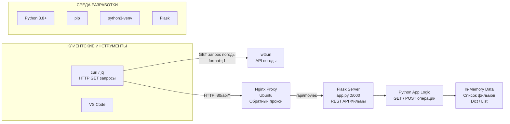

# Лабораторная работа №2

## Проектирование и реализация клиент-серверной системы. HTTP, веб-серверы и RESTful веб-сервисы.

---

## 1. Титульный лист.

* **Студент:** *Войнова Екатерина Андреевна*
* **Группа:** *ЦИБ-241*
---

## 2. Цель работы.

Изучить методы отправки и анализа HTTP-запросов с использованием инструментов **telnet** и **curl**, освоить базовую настройку и анализ работы HTTP-сервера **nginx** в качестве веб-сервера и обратного прокси, а также изучить и применить на практике концепции архитектурного стиля **REST** для создания веб-сервисов (API) на языке **Python**.

---
## 3. Краткие теоретические сведения.

### HTTP (HyperText Transfer Protocol).

HTTP — это протокол прикладного уровня для передачи данных между клиентом и сервером.

HTTP-запрос содержит:

* метод (GET, POST, PUT, DELETE)
* URI (адрес ресурса)
* заголовки
* тело запроса (необязательно)

HTTP-ответ содержит:

* код состояния (200 OK, 404 Not Found, 302 Redirect)
* заголовки
* тело ответа (HTML, JSON и др.)

---

### Telnet и Curl.

### Telnet.

Позволяет подключаться к серверу на определенный порт и отправлять HTTP-запросы вручную.

### Curl.

Инструмент командной строки для отправки HTTP-запросов.

Позволяет:

* отправлять GET и POST
* передавать JSON
* смотреть заголовки ответа
* тестировать API

---

### Nginx.

**Nginx** — высокопроизводительный веб-сервер.

Он может работать как:

### Веб-сервер.

Отдает статические файлы:

* HTML
* CSS
* изображения

### Reverse Proxy.

Принимает запрос от клиента и перенаправляет его на другой сервер (например Flask).

Это позволяет:

* скрыть внутреннюю архитектуру
* распределять нагрузку
* добавлять HTTP-заголовки

---

### REST и REST API.

REST — архитектурный стиль для разработки веб-сервисов.

Основные принципы:

* клиент-серверная архитектура
* отсутствие состояния (stateless)
* использование стандартных HTTP методов

### HTTP методы.

* **GET** — получение ресурса
* **POST** — создание ресурса
* **PUT / PATCH** — обновление
* **DELETE** — удаление

---

## 4. Задания.
* Запрос погоды для своего города с помощью curl wttr.in/Город.
* API для "Коллекция фильмов" (сущность: id, title, director, year).
* Настроить Nginx как обратный прокси для Flask API.
---
## 4.1  Архитектура решения.


## 5. Ход выполнения работы.

## 5.1 Задание 1. Запрос погоды для своего города с помощью curl wttr.in/Город.

### 5.1.1 Установка необходимых утилит.

```bash
sudo apt update
sudo apt install curl -y
sudo apt install jq -y
```
`5.1.2 Проверка работы curl.`

-curl --version

-Результат:


### 5.1.3 Запрос погоды для Москвы c результатом вывода.


### 5.1.4 Анализ HTTP-заголовков.


Анализ полученных заголовков:

Первая строка ответа показывает, что запрос выполнен успешно — сервер вернул код состояния 200.

Заголовок указывает, что сервер разрешает кросс-доменные запросы с любых источников, что позволяет обращаться к API из браузера с любых сайтов.

Заголовок показывает размер тела ответа в байтах — 8673 байта информации было передано от сервера клиенту.

Заголовок информирует о том, что тип данных — обычный текст в кодировке UTF-8, которая поддерживает все символы русского языка.

Заголовок указывает точное время формирования ответа на сервере по Гринвичу.

Таким образом, сервер успешно обработал запрос, вернул код 200 OK и предоставил данные о погоде в текстовом формате с поддержкой для всех доменов.

## 5.2 Задание 2. API для "Коллекция фильмов" (сущность: id, title, director, year).
### 5.2.1 Создание структуры проекта.
```
cd ~/Downloads/ds/lb_02
mkdir movie_api
cd movie_api
```
### 5.2.2 Создание и активация виртуального окружения.
```
python3 -m venv venv
source venv/bin/activate
```

### 5.2.3 Установка Flask.
```
pip install Flask
```
--Результат:


### 5.2.4 Код REST API (app.py).


## 5.3 Запуск Flask сервера.

### 5.3.1 Запуск приложения.


Сервер успешно запустился и ожидает запросов на порту 5000.

### 5.3.2 Тестирование API.
Для тестирования был открыт второй терминал.

GET-запрос (получение всех фильмов):


POST-запрос (добавление нового фильма):


Проверка после добавления:


В списке появился третий фильм "Матрица".

## 5.4 Задание 3. Настроить Nginx как обратный прокси для Flask API.
### 5.4.1 Установка Nginx и запуск Nginx.
```
sudo apt update
sudo apt install nginx -y
```


### 5.4.2 Проверка работы.


### 5.4.3 Настройка проксирования.
Открытие конфигурационного файла:
```
sudo nano /etc/nginx/sites-available/default
```


### 5.4.5 Проверка конфигурации и перезапуск Nginx.


### 5.5 Тестирование API через Nginx.
### 5.5.1 GET-запрос через Nginx.


### 5.5.2 POST-запрос через Nginx.


### 5.5.3 Проверка после POST-запроса.


### 5.5.4 Проверка заголовков ответа от Nginx.


В ответе присутствует заголовок Server: nginx/1.18.0 (Ubuntu), что подтверждает, что запрос прошел через Nginx.

## 6. Выводы.
В ходе выполнения лабораторной работы были изучены и практически применены основные принципы клиент-серверного взаимодействия, протокол HTTP, методы отправки запросов с использованием инструмента curl, а также основы настройки веб-сервера Nginx в качестве обратного прокси.
