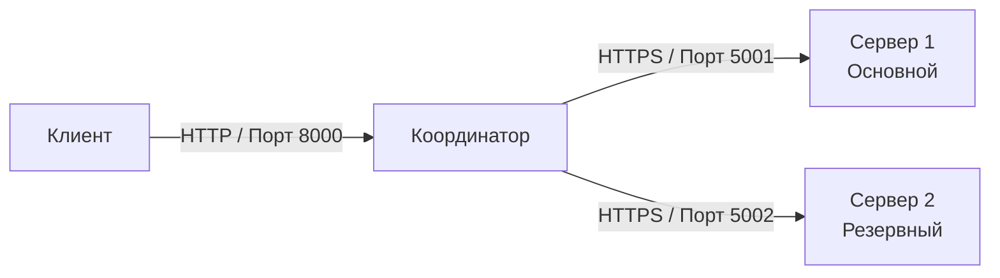

# Лабораторная работа №4. Реализация механизмов безопасности в распределенной системе

## Цель работы.

Разработать распределенную систему, обеспечивающую защищенную передачу данных с использованием взаимной аутентификации (mTLS) и симметричного шифрования, а также продемонстрировать механизмы отказоустойчивости (failover) через автоматическое переключение между узлами.

## Задачи.

1. **Настройка PKI**  
   Сгенерировать сертификаты X.509 для центра сертификации (CA), серверов и клиентов.

2. **Обеспечение безопасности**  
   Реализовать HTTPS-соединения с взаимной аутентификацией (mTLS) и шифрование полезной нагрузки алгоритмом Fernet.

3. **Разработка компонентов**  
   Реализовать серверы обработки данных, клиентское приложение и координатор (балансировщик нагрузки).

4. **Реализация отказоустойчивости**  
   Настроить логику автоматического перенаправления запросов на резервный сервер при недоступности основного.

5. **Выполнение индивидуального задания**  
   Расширить функциональность системы согласно варианту.

## Индивидуальное задание (вариант 2).

**Аутентификация Login/Pass**.  
Заменить сертификаты на проверку логина/пароля. Добавить функцию проверки на сервере.

## Схема потоков данных (с резервным сервером).


## Работа с OpenSSL: генерация самоподписанного сертификата центра сертификации (CA).


На скриншоте представлен процесс создания самоподписанного сертификата корневого центра сертификации (CA) с помощью утилиты OpenSSL.

### Выполняемая команда.
```bash
openssl.exe req -x509 -newkey rsa:4096 -nodes -keyout ca_key.pem -out ca_cert.pem -days 365 -subj "/CN=MyCA"
```

### Созданные файлы центра сертификации.


| Файл | Назначение |
|------|------------|
| `ca_cert.pem` | Публичный сертификат центра сертификации. Содержит открытый ключ CA и информацию о его владельце. Распространяется среди всех участников системы (серверов и клиентов) для проверки подлинности сертификатов, подписанных этим CA. |
| `ca_key.pem` | Закрытый ключ центра сертификации. Используется для подписи сертификатов серверов и клиентов. **Должен храниться в строгой секретности**, так как компрометация этого ключа позволяет злоумышленнику выпускать поддельные сертификаты от имени доверенного CA. |


## OpenSSL: генерация закрытого ключа и запроса на подпись сертификата (CSR) для сервера.


На скриншоте представлен процесс создания закрытого ключа и запроса на подпись сертификата (Certificate Signing Request, CSR) для серверного узла.

### Выполняемая команда.

```bash
openssl.exe req -newkey rsa:4096 -nodes -keyout server_key.pem -out server_csr -subj "/CN=localhost"
```

## Файлы сервера после генерации ключа и CSR.


На скриншоте показаны файлы, относящиеся к серверному узлу, созданные в процессе настройки сертификатов.

### Состав файлов.

| Файл | Назначение |
|------|------------|
| `server_key.pem` | Закрытый ключ сервера (RSA, 4096 бит). Используется сервером для расшифровки входящих данных и установки mTLS-соединения. |
| `server.csr` | Запрос на подпись сертификата (Certificate Signing Request). Этот файл отправляется в центр сертификации (CA) для получения подписанного сертификата сервера. |
| `server.py` | Исполняемый файл серверного приложения. Реализует логику обработки запросов, mTLS и аутентификации. |

## OpenSSL: подписание сертификата сервера центром сертификации (CA).


На скриншоте представлен процесс подписания запроса на сертификат сервера с использованием закрытого ключа центра сертификации.

### Выполняемая команда.

```bash
openssl.exe x509 -req -in server.csr -CA ca_cert.pem -CAkey ca_key.pem -out server_cert.pem -days 365
```

## OpenSSL: генерация закрытого ключа и запроса на подпись сертификата (CSR) для сервера.


На скриншоте представлен процесс создания закрытого ключа и запроса на подпись сертификата (Certificate Signing Request, CSR) для клиента.

## Файлы клиента после генерации ключа и CSR.


## OpenSSL: подписание сертификата сервера центром сертификации (CA).


### Все получившиеся папки.


## Генерация ключа шифрования Fernet.

На скриншоте показан запуск скрипта `generate_key.py`, который создаёт ключ для симметричного шифрования данных алгоритмом Fernet.


## Установка необходимых библиотек Python.


| Библиотека | Назначение |
|------------|-------------|
| **Flask** | Микрофреймворк для создания веб-приложений. Используется для реализации координатора и серверов. |
| **requests** | HTTP-библиотека для отправки запросов. Используется клиентом и координатором для взаимодействия с серверами. |
| **cryptography** | Набор криптографических средств. Используется для работы с Fernet (симметричное шифрование) и mTLS. |


### 1. Запуск сервера на порту 5002 (резервный узел).

```bash
py server.py 5002
```
### 2. Запуск основного сервера (порт 5001).

```bash
py server.py 5001
```
### 3. Запуск координатора

```bash
py coordinator.py
```

## Запуск клиента и выводы.


| Проверка | Результат |
|----------|-----------|
| Запуск основного сервера (5001) | Успешно |
| Запуск резервного сервера (5002) | Успешно |
| Запуск координатора (8000) | Успешно |
| Отправка запроса клиентом | Статус 200, ответ получен |
| Аутентификация пользователя `alice` | Успешно |
| Обработка запроса основным сервером | `server_port: 5001` |

### Итог

Разработанная распределенная система обеспечивает:
- Защищенную передачу данных с использованием mTLS и симметричного шифрования Fernet.
- Отказоустойчивость через автоматическое переключение между серверами.
- Аутентификацию клиентов по логину и паролю с проверкой на стороне сервера согласно индивидуальному заданию.
